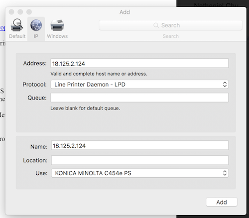

# Directories
- wet-lab-info: information related to working in the wet lab, e.g. protocols, equipment, safety, best practices, cleaning, etc
- EHS: useful information about EHS things

# Group meetings

The group meeting schedule is coordinated by Shandrina and can be found
[here](https://docs.google.com/spreadsheets/d/17K3eK_GNoXbfFCrVFLCtRt8-y-yPYsn6nRgP5LRPi04/edit#gid=1242452859)

# Adding yourself to the website

Our lab website is at [almlab.mit.edu](http://almlab.mit.edu/).

To add yourself to the website, follow the instructions [here](https://github.com/almlab/www/wiki/Add-new-member-content).

As of February 2017, Claire Duvallet (duvallet[at]mit[dot]edu)
is the person you should contact to get added to the website.

## Unofficial group meetings

On weeks when Eric is away, people can self-organize informal presentations/discussions if desired,
but this will not be coordinated by Shandrina or otherwise formalized. These will be entirely optional.

# Printing

The following instructions should help you get set up with the printer in room 318. If you're prompted
for a password, ask someone in the Alm lab for it.

* Go to Konica’s driver website: http://onyxweb.mykonicaminolta.com/OneStopProductSupport
* Search for Category = Multifunction Color Printers | bizhub C454e | Drivers | Mac OS whatever.
* Download, unzip, install.
* Add a printer with IP address: 18.125.2.124
  * Select software, find Konica bizhub C454e PS
  * You might also need to select the non-default Protocol

* Get the right Finisher option (FS-534); all other defaults are fine

# Other files
- members.md: current and former members, including links to their github accounts
